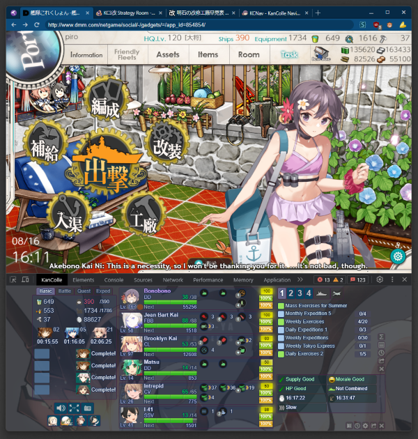
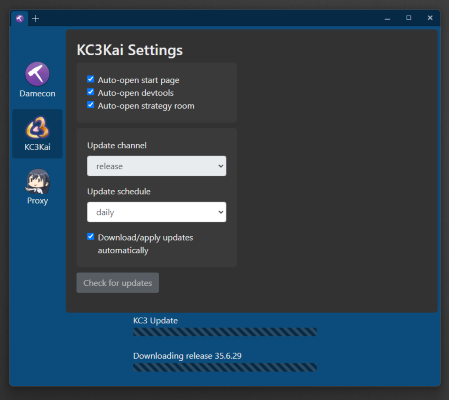
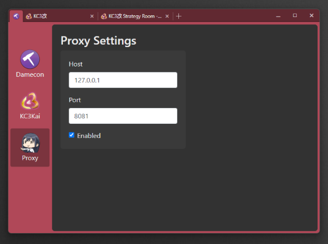
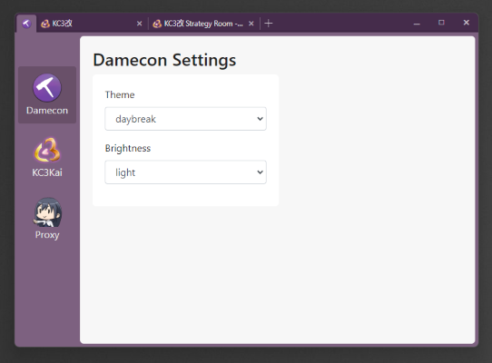
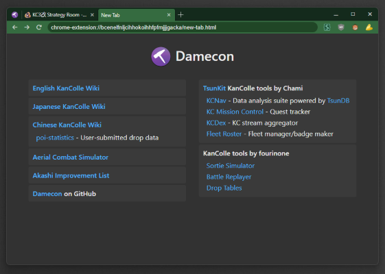

#  damecon-browser

A minimal, tabbed web browser for playing Kantai Collection, with integrated KC3Kai and KCCacheProxy support.



## Usage

###  From a Release build:
Download the `damecon-browser-*-win.zip`, extract it to an empty folder, and run `damecon-browser.exe`.

### From source code, using `yarn`:
```bash
# Get the code
git clone git@github.com:planetarian/damecon-browser.git
cd damecon-browser

# Install and launch the browser
yarn
yarn start
```

### 🔌 Install extensions

Unpacked (NOT `.crx`) extensions inside `./extensions` will be loaded automatically.
- Currently only supports extensions using Manifest v2.
- Some plugins may not run properly (or at all) due to some extension APIs being unsupported.

There are a few plugins bundled with the Release builds. It is safe to remove them, but attempting to update them will likely not work.

### ⚙️ Configure settings

On first launch, the settings page will open.

It will automatically begin downloading the latest Release version of KC3Kai, and upon completion, the KC3 start page will open.

You can access the Damecon settings again at any time by clicking the damecon icon at the top-left corner of the window.

### KC3Kai Update Configuration

The KC3Kai section in the settings page allows you to configure how KC3 is updated.

You can select from three different update channels: `release`, `master`, and `develop`.
- It is recommended to remain on the `release` channel, for the most stable experience.
- `master` and `develop` contain code actively in development, and may be unstable.
  - If using one of these two channels, the initial update may take several minutes to complete.
- Different channels are stored independently and have their own separate profiles.
  - You can switch between channels at any time, and those channels won't need to be re-downloaded.
  - Switching channels will automatically unload the old channel's extension and load the new one in.
  - To remove the files for a channel, simply delete the associated `kc3kai-*` folder within `./extensions`.

## ⚠️ Notice

#### Damecon is NOT intended to be used as a general-purpose browser.

Damecon is designed for one purpose only, and that is playing KanColle.

Damecon is built upon Electron, and lacks many of the security features of major browsers. Plus, I have no idea what I'm doing.

Seriously, I've literally never worked with Electron before. There's some real spaghetti-tier code going on here. Do you really wanna put your trust in that?

#### If you use Damecon for any activities involving sensitive information, you do so at your own risk.


## Features

### ✨ Showcase


Configurable KC3Kai autostart/update options:




KCCacheProxy client options:




Themes:




New Tab launch page:



### 🚀 Current

- [x] KC3Kai integration
- [x] Automatic updates for KC3
- [x] Support both release and in-development versions of KC3
- [x] Configurable KC3 update schedule (daily/weekly/always/never)
- [x] Auto-open KC3 start page (with developer tools) and strategy room
- [x] KCCacheProxy client support
- [x] Color and light/dark theme support
- [x] New Tab page with links to common third-party KanColle resources
- [ ] Option to ask before installing KC3 updates
- [ ] Common keyboard shortcuts (F12, Ctrl+T, Ctrl+F4, etc)
- [ ] Common mouse gestures (Tab middle-click, draggable tabs, Ctrl+scroll, etc)
- [ ] Link hover URL tooltips
    

### 🤞 Eventually
- [ ] Extension management (enable/disable/uninstall)
- [ ] Application auto-update
- [ ] .CRX extension loader
- [ ] Support for more common [`chrome.*` extension APIs](https://developer.chrome.com/extensions/devguide)
    - Unlikely as I can't wrap my head around the API wrapper lol
- [ ] Respect extension manifest permissions
    - I must reiterate, this is *not* a secure browser

### ❌ Not planned

- Multi-window / detachable tabs
- Manifest V3
- Chrome webstore (requires MV3)
- Advanced general-use browser features from Chrome/Edge/etc
    - Including password manager and other security features
- AI integration of any kind (you're welcome)

## License

GPL-3

This project is based on the `electron-browser-shell` project by Samuel Maddock.

The following notice has been retained from the original repository:

> For proprietary use [of electron-browser-shell], please [contact [samuelmaddock]](mailto:sam@samuelmaddock.com?subject=electron-browser-shell%20license) or [sponsor [samuelmaddock] on GitHub](https://github.com/sponsors/samuelmaddock/) under the appropriate tier to [acquire a proprietary-use license](https://github.com/samuelmaddock/electron-browser-shell/blob/master/LICENSE-PATRON.md). These contributions help make development and maintenance of this project more sustainable and show appreciation for the work thus far.

### Contributor license agreement

By sending a pull request, you hereby grant to owners and users of the
electron-browser-shell project a perpetual, worldwide, non-exclusive,
no-charge, royalty-free, irrevocable copyright license to reproduce, prepare
derivative works of, publicly display, publicly perform, sublicense, and
distribute your contributions and such derivative works.

The owners of the damecon-browser/electron-browser-shell projects will also be granted the right to relicense the
contributed source code and its derivative works.
